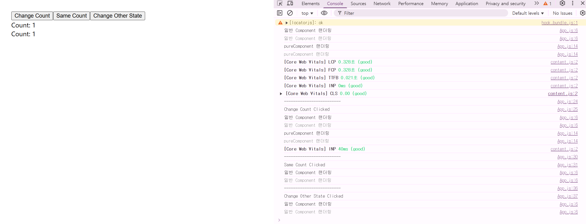

# 클래스형 vs 함수형 컴포넌트 (React)

연관질문

- 생명주기 매서드에 대해 설명해주세요
- shouldComponentUpdate에 대해 설명해주세요
- pure component에 대해 설명해주세요

## 📌 React 생명주기(Life Cycle)

React 컴포넌트는 크게 다음 세 가지 생명주기로 관리됩니다:

- **마운트(Mount)**
- **업데이트(Update)**
- **언마운트(Unmount)**

### 대표적인 생명주기 메서드

- `componentDidMount`: 컴포넌트가 처음 DOM에 마운트된 직후 호출됩니다.
- `componentDidUpdate`: 상태나 prop의 변화로 인해 컴포넌트가 다시 렌더링된 직후 호출됩니다.
- `componentWillUnmount`: 컴포넌트가 DOM에서 제거되기 직전에 호출됩니다.

```jsx
class ExampleComponent extends React.Component {
  componentDidMount() {
    // API 호출 등 초기 데이터 로드
  }

  componentDidUpdate(prevProps, prevState) {
    // 상태 업데이트 후 추가 작업 수행
  }

  componentWillUnmount() {
    // 리소스 정리 및 이벤트 리스너 제거
  }

  render() {
    return <div>Hello, World!</div>;
  }
}
```

## React16.8버전 이전

함수형 컴포넌트의 경우, 생명주기 매서드도 없으며, 내부 상태를 관리할 수 있는 방법이 없었습니다.

따라서, props에 의해서만 상태를 나타낼 수 있어 UI로만의 업무만 담당할 수 있었음

클래스 컴포넌트는 생명주기 매서드가 존재, 내부에서 상태 관리가 가능함 contstruct를 통해 값을 초기화 하고 생명주기를 통해 값을 가져옴 ex) api요청

즉, 16.8 버전 이전에서의 React 컴포넌트는 클래스 컴포넌트로 구성됨

## 📌 Component vs PureComponent

### Component

- React에서 가장 기본적인 컴포넌트 클래스.
- props나 state 변경 여부와 **상관없이** 리렌더링 조건이 발생하면 항상 렌더링.
- 성능 최적화 필요 시, `shouldComponentUpdate` 메서드 직접 구현 필요.

### PureComponent

- Component를 상속받으며 자동으로 props와 state를 얕은 비교(shallow comparison)하여 변경이 있을 때만 렌더링.
- 불필요한 리렌더링 방지하여 성능 최적화에 유리.
- 객체나 배열과 같은 참조 타입의 깊은 변경은 감지하지 못하는 단점 존재.

> 📌 `shouldComponentUpdate` <br/>
> 클래스형 컴포넌트의 성능 최적화를 위한 생명주기 메서드 <br/>
> 불필요한 렌더링을 방지하여 성능을 개선

### 예시 코드

```jsx
// 일반 Component
class RegularComponent extends React.Component {
  render() {
    console.log("일반 Component 랜더링");
    return <div>Count: {this.props.count}</div>;
  }
}

// PureComponent
class OptimizedComponent extends React.PureComponent {
  render() {
    console.log("pureComponent 랜더링");
    return <div>Count: {this.props.count}</div>;
  }
}

// 부모 컴포넌트
class Parent extends React.Component {
  state = { count: 0, unchanged: 0 };

  incrementCount = () => {
    console.log("Change Count Clicked");
    this.setState({ count: this.state.count + 1 });
  };

  sameCount = () => {
    console.log("Same Count Clicked");
    this.setState({ count: this.state.count });
  };

  incrementUnchanged = () => {
    console.log("Change Other State Clicked");
    this.setState({ unchanged: this.state.unchanged + 1 });
  };

  render() {
    return (
      <div>
        <button onClick={this.incrementCount}>Change Count</button>
        <button onClick={this.sameCount}>Same Count</button>
        <button onClick={this.incrementUnchanged}>Change Other State</button>

        <RegularComponent count={this.state.count} />
        <OptimizedComponent count={this.state.count} />
      </div>
    );
  }
}
```

## 

### 클래스형 컴포넌트의 한계

1. **데이터 흐름 추적이 어려움**

   - 여러 생명주기 메서드에 상태 업데이트 로직이 흩어짐

2. **내부 로직 재사용의 어려움**
   - 고차 컴포넌트(HOC), Render Props 등 복잡한 패턴 필요

예시:

**클래스형 컴포넌트**

```jsx
class UserProfile extends React.Component {
  state = { user: null, posts: [] };

  fetchingData = () => {
    fetchUser(this.props.userId).then((user) => this.setState({ user }));
    fetchPosts(this.props.userId).then((posts) => this.setState({ posts }));
  };

  componentDidMount() {
    this.fetchingData();
  }
  componentDidUpdate(prevProps) {
    if (prevProps.userId !== this.props.userId) this.fetchingData();
  }

  handleRefresh = () => {
    this.fetchingData();
  };

  render() {
    return <div>{/* 렌더링 로직 */}</div>;
  }
}
```

**함수형 컴포넌트** (Hooks 사용)

```jsx
function UserProfile({ userId }) {
  const [user, setUser] = useState(null);
  const [posts, setPosts] = useState([]);

  const fetchingData = () => {
    fetchUser(userId).then(setUser);
    fetchPosts(userId).then(setPosts);
  };

  useEffect(() => {
    fetchingData();
  }, [userId]);

  const handleRefresh = () => {
    fetchingData();
  };

  return <div>{/* 렌더링 로직 */}</div>;
}
```

---

## 📌 클래스형 컴포넌트 vs 함수형 컴포넌트

| 구분          | 클래스형 컴포넌트                        | 함수형 컴포넌트          |
| ------------- | ---------------------------------------- | ------------------------ |
| 상태관리      | 가능(state)                              | useState로 가능          |
| 생명주기 관리 | 메서드(componentDidMount 등)             | useEffect로 가능         |
| 코드 작성량   | 많음(class, render, constructor 등 필요) | 적음(간결하고 직관적)    |
| 메모리 사용량 | 상대적으로 많음                          | 상대적으로 적음          |
| 마운트 속도   | 느림(render 메서드 존재)                 | 빠름(render 메서드 없음) |

## ⚠️ 함수형 vs 클래스형 컴포넌트의 클로저와 최신 값 참조 차이

함수형 컴포넌트에서 선언된 모든 함수는 **클로저(Closure)** 로 동작합니다.  
이 특성은 **비동기 로직** 또는 **이벤트 핸들러 작성 시 상태나 props의 참조 방식**에 큰 영향을 줍니다.

---

### 📌 예제 코드

#### ✅ 함수형 컴포넌트

showMessage는 렌더링 시점의 props.user 값을 클로저로 캡처함!

버튼을 클릭한 후 3초 이내에 props.user가 바뀌어도 초기값이 출력됨

```jsx
function ProfilePage(props) {
  const showMessage = () => {
    alert("Followed " + props.user);
  };

  const handleClick = () => {
    setTimeout(showMessage, 3000); // 렌더링 시점의 props.user가 고정됨
  };

  return <button onClick={handleClick}>Follow</button>;
}
```

✅ 클래스형 컴포넌트

클래스형은 항상 최신 props/state를 참조함!

버튼 클릭 후 3초 안에 props.user가 바뀌면 변경된 값이 출력됨

```jsx
코드 복사
class ProfilePage extends React.Component {
  showMessage = () => {
    alert('Followed ' + this.props.user);
  };

  handleClick = () => {
    setTimeout(this.showMessage, 3000); // 호출 시점의 최신 this.props.user 사용
  };

  render() {
    return <button onClick={this.handleClick}>Follow</button>;
  }
}
```

🧠 왜 중요한가요?

함수형 컴포넌트의 클로저 특성을 이해하지 못하면 다음과 같은 문제가 발생할 수 있습니다:

비동기 타이머(setTimeout, setInterval) 안에서 상태 값이 초기값으로 유지

이벤트 핸들러가 오래된 상태를 참조

비동기 요청 이후 처리 로직이 과거 상태 기준으로 동작

✅ 해결 방법 (최신 값을 참조하는 안전한 패턴)

```jsx
코드 복사
const latestUserRef = useRef();

useEffect(() => {
  latestUserRef.current = props.user;
}, [props.user]);

const showMessage = () => {
  alert('Followed ' + latestUserRef.current);
};
```

useRef를 활용해 항상 최신 값을 참조할 수 있도록 설정

💡 면접에서 자주 나오는 포인트

“함수형 컴포넌트에서 최신 상태를 참조하고 싶다면 어떻게 해야 하나요?”

“클래스형에서는 왜 항상 최신 값을 참조하나요?”

### 🚀 왜 함수형 컴포넌트인가?

- 선언이 쉽고 간결하여 가독성 높음
- 메모리 자원을 적게 사용
- 빌드 파일 크기 작고, 성능이 우수함
- Hook 도입(useState, useEffect 등)으로 상태 및 생명주기 관리가 간편해졌으며, 코드 재사용성이 크게 향상됨.
